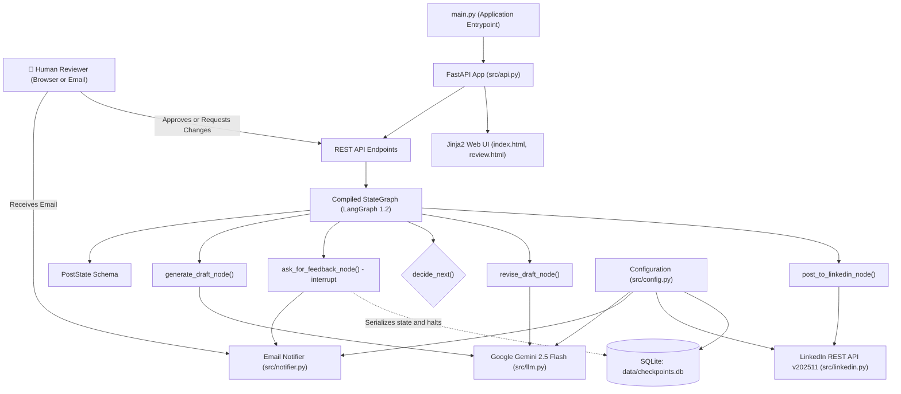
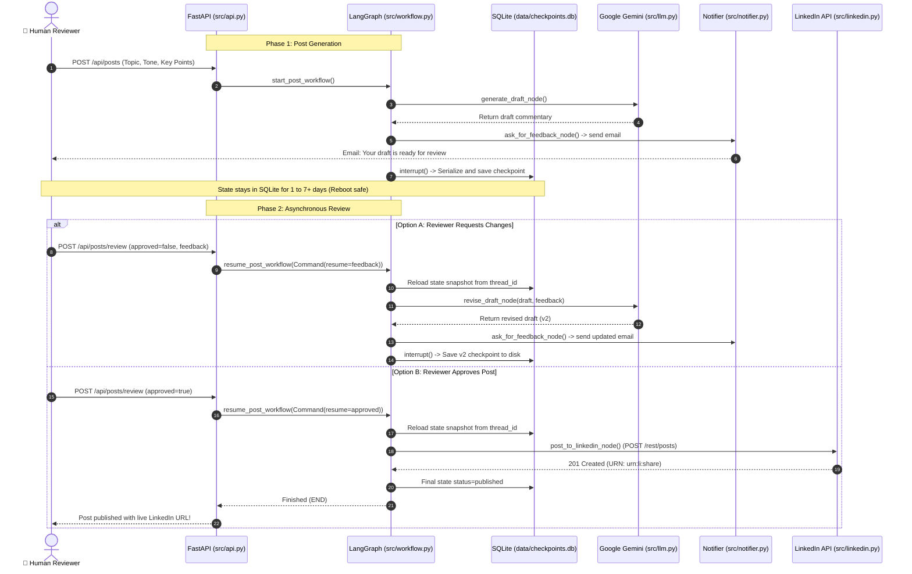

# Human-in-the-Loop (HITL) LinkedIn Agent — Architecture Reference

This document provides a function-by-function and layer-by-layer architectural breakdown of the codebase, explaining how all modules in `src/` connect to `main.py`.

> [!TIP]
> For an interactive visual experience with clickable nodes and live inspectors, open [architecture_visualization.html](architecture_visualization.html) in your browser!

---

## 1. System Architecture Diagram



---

## 2. Asynchronous Sequence Lifecycle (1 to 7+ Days)



---

## 3. Function-by-Function Breakdown

### Root Entrypoint: `main.py`
- `main()`: Initializes logging and calls `uvicorn.run("src.api:app", host="0.0.0.0", port=8000, reload=True)` to run the ASGI application.

### `src/config.py` (Configuration)
- `Settings(BaseSettings)`: Pydantic configuration class that loads environment variables from `.env`.
  - Properties: `GOOGLE_API_KEY`, `GEMINI_MODEL` (default: `gemini-2.5-flash`), `LINKEDIN_ACCESS_TOKEN`, `LINKEDIN_AUTHOR_URN`, `LINKEDIN_API_VERSION` (default: `202511`), `SMTP_HOST`, `SMTP_PORT`, `SMTP_USER`, `SMTP_PASSWORD`, `NOTIFICATION_EMAIL`, `SQLITE_DB_PATH`.
- `settings`: Global singleton instance.

### `src/state.py` (State Modeling)
- `WorkflowStatus(Enum)`: Enums for `drafting`, `waiting_for_approval`, `revising`, `published`, `error`.
- `RevisionHistoryItem(TypedDict)`: History item containing `revision`, `draft`, `feedback`, `timestamp`.
- `PostState(TypedDict)`: The shared LangGraph channel schema holding:
  - `thread_id`: Unique identifier for the conversation/post.
  - `info`: User parameters (topic, key points, tone, audience).
  - `draft`: Current text under review.
  - `human_feedback`: Critique submitted by the human.
  - `approved`: Boolean flag.
  - `final_post`: Approved post content.
  - `post_id`: Published LinkedIn post URN.
  - `post_url`: Direct link to the post on LinkedIn.
  - `history`: List of all revisions.

### `src/llm.py` (Model Factory)
- `get_llm() -> ChatOpenAI`: Configures the LLM provider.
  - Prioritizes Google Gemini 2.5 Flash via OpenAI-compatible endpoint (`https://generativelanguage.googleapis.com/v1beta/openai/`) using `GOOGLE_API_KEY`.
  - Fallbacks for Groq and OpenAI if configured.

### `src/linkedin.py` (LinkedIn REST API)
- `verify_credentials() -> dict`: Makes GET request to `https://api.linkedin.com/v2/userinfo` to check if token is valid.
- `publish_post(commentary: str, dry_run: bool = False) -> dict`:
  - Makes POST request to `https://api.linkedin.com/rest/posts`.
  - Headers: `LinkedIn-Version: 202511`, `X-Restli-Protocol-Version: 2.0.0`, `Authorization: Bearer <token>`.
  - Parses `x-restli-id` and constructs live post URL.
  - Provides dry-run simulation mode if credentials are in testing mode.

### `src/notifier.py` (Email & Notifications)
- `NotificationStore`: In-app circular buffer storing up to 100 recent notifications for display on the dashboard.
- `EmailNotifier.send_draft_ready_notification(...)`: Formats email with message:
  > *"Your draft is ready. If you are okay with this, you can just approve or if you need any changes, you can just provide the changes."*
  - Generates direct review link (`/review/{thread_id}`) and 1-click approve link (`/api/posts/{thread_id}/quick-approve`).
  - Sends multipart MIME email via SMTP with TLS when credentials exist.

### `src/checkpointer.py` (SQLite Persistence)
- `get_db_connection() -> sqlite3.Connection`: Returns persistent thread-safe SQLite connection to `data/checkpoints.db`.
- `get_checkpointer() -> SqliteSaver`: Returns configured LangGraph `SqliteSaver` instance for state persistence across server reboots.
- `save_post_metadata(...)` / `get_all_posts_metadata()`: Fast indexing table to display cards on the dashboard.

### `src/nodes.py` (LangGraph Nodes)
- `generate_draft_node(state: PostState) -> dict`: Prompts Gemini to write initial draft; sets status to `waiting_for_approval`.
- `ask_for_feedback_node(state: PostState) -> dict`:
  1. Sends notification email with review links.
  2. Executes `interrupt({"draft": draft})` to halt execution.
  3. Resumes when human responds with approval or critique.
- `decide_next(state: PostState) -> str`: Conditional edge returning `"post_to_linkedin"` if approved, else `"revise_draft"`.
- `revise_draft_node(state: PostState) -> dict`: Prompts Gemini with previous draft + human feedback to write a revised version.
- `post_to_linkedin_node(state: PostState) -> dict`: Calls `LinkedInPublisher().publish_post(draft)` to publish to LinkedIn.

### `src/workflow.py` (Workflow Orchestrator)
- `build_workflow_graph() -> StateGraph`: Assembles nodes, edges, conditional edges, and compiles with `SqliteSaver`.
- `start_post_workflow(...) -> dict`: Creates a thread, runs graph to the first interrupt, and returns draft.
- `resume_post_workflow(thread_id, approved, feedback) -> dict`: Wakes up interrupted graph using `Command(resume=...)`.
- `get_post_details(thread_id) -> dict`: Retrieves snapshot from SQLite.
- `list_posts() -> list`: Lists all posts from metadata index.

### `src/schemas.py` (Pydantic Models)
- `PostCreateRequest`: Validates payload for `POST /api/posts`.
- `ReviewRequest`: Validates payload for `POST /api/posts/{thread_id}/review`.
- `PostSummaryResponse` & `PostDetailResponse`: Serialization schemas for API responses.
- `HealthResponse`: Status schema for `/api/health`.

### `src/api.py` (FastAPI Server)
- `GET /`: Renders main dashboard (`index.html`).
- `GET /review/{thread_id}`: Renders dedicated review page (`review.html`).
- `POST /api/posts`: Starts post creation.
- `GET /api/posts`: Lists all posts.
- `GET /api/posts/{thread_id}`: Gets single post state.
- `POST /api/posts/{thread_id}/review`: Resumes workflow with approval or revisions.
- `GET /api/posts/{thread_id}/quick-approve`: 1-Click approval redirect from email.
- `GET /api/notifications`: Returns notification logs.
- `GET /api/health`: Health status.

---

## 4. How Execution Connects to `main.py`

```
main.py
  └── uvicorn.run("src.api:app")
        ├── src/config.py: loads .env
        ├── src/checkpointer.py: connects data/checkpoints.db
        ├── src/workflow.py: compiles StateGraph with SqliteSaver
        │     ├── src/nodes.py (generate, interrupt, revise, post)
        │     ├── src/llm.py (Gemini 2.5 Flash)
        │     ├── src/notifier.py (SMTP Email & Notification Store)
        │     └── src/linkedin.py (LinkedIn REST API v202511)
        └── src/api.py: serves HTTP endpoints & HTML templates
```
