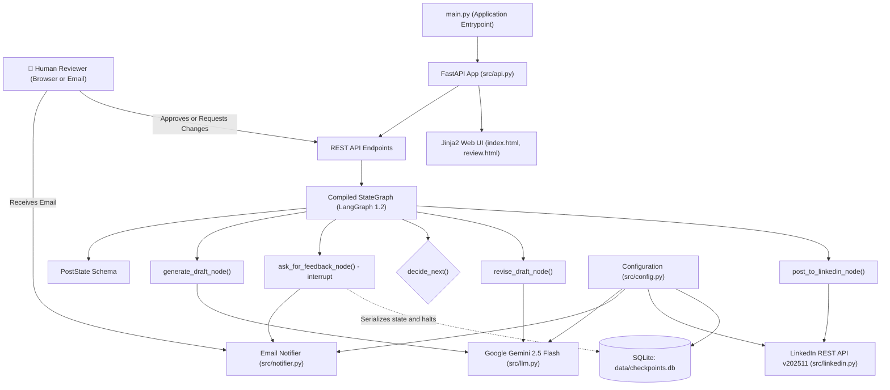
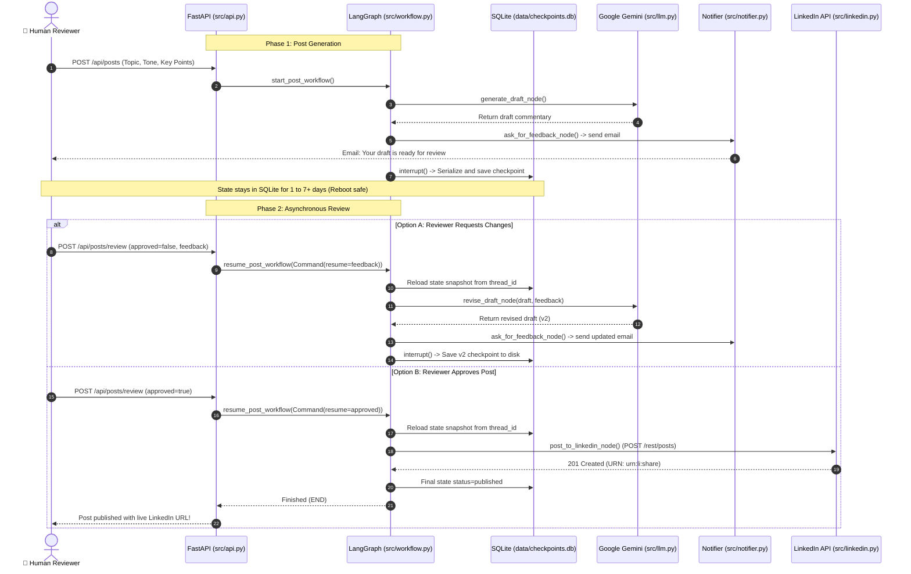

# Human-in-the-Loop (HITL) LinkedIn Agent

[](https://fastapi.tiangolo.com)
[](https://github.com/langchain-ai/langgraph)
[](https://www.python.org/)
[](https://ai.google.dev/)
[](https://learn.microsoft.com/en-us/linkedin/)

An enterprise-ready **Human-in-the-Loop (HITL) Autonomous Agent** for drafting, reviewing, revising, and automatically publishing LinkedIn posts. Built with **LangGraph**, **Google Gemini 2.5 Flash**, **FastAPI**, **persistent SQLite checkpointing**, and **LinkedIn REST API (Version 202511)**.

---

## Interactive Architecture Visualizer

We provide a self-contained interactive visualizer right in the root of the project:
```bash
# Open in your browser
open architecture_visualization.html
```
- **State Machine Explorer**: Click on nodes (`generate_draft`, `ask_for_feedback`, `decide_next`, `revise_draft`, `post_to_linkedin`) to inspect their inputs, outputs, and live python code.
- **Layer Architecture & Sequence Diagrams**: Native rendered diagrams showing the end-to-end data flow.
- **Function-by-Function Inspector**: Complete index of every class and method.
- **7-Day Asynchronous Lifecycle**: Explains why in-memory savers fail and how SQLite persistence guarantees durability across days.

---

## 1. System Architecture Diagram



---

## 2. Asynchronous 7-Day Review Lifecycle

In enterprise production, human reviewers rarely approve instantly. A reviewer might take **1 hour, 3 days, or 7+ days** to review a post. The sequence below demonstrates how the agent safely halts and resumes without keeping threads sleeping or consuming resources:



---

## 3. How Everything Connects to `main.py` in the Root

```
main.py (Root)
   │
   └──► uvicorn.run("src.api:app", host="0.0.0.0", port=8000, reload=True)
           │
           ├──► [1] loads src.config.settings (reads .env credentials & config)
           │
           ├──► [2] loads src.api.app (registers REST routes & mounts Jinja2 templates)
           │
           ├──► [3] compiles src.workflow.get_graph()
           │        │
           │        ├── attaches src.checkpointer.get_checkpointer() (SQLite: data/checkpoints.db)
           │        └── connects StateGraph nodes:
           │              ├── generate_draft_node  ──► calls src.llm.get_llm() (Gemini 2.5 Flash)
           │              ├── ask_for_feedback_node ──► calls src.notifier.send_draft_ready_notification()
           │              │                             & calls interrupt()
           │              ├── decide_next (conditional router)
           │              ├── revise_draft_node    ──► calls src.llm.get_llm()
           │              └── post_to_linkedin_node ──► calls src.linkedin.LinkedInPublisher()
           │
           └──► [4] Listens for HTTP traffic on http://localhost:8000
```

---

## 4. Function-by-Function Codebase Breakdown

### Root Entrypoint: `main.py`
- `main()`: The starting point of the application. Reads port and host from `src.config.settings` and runs the FastAPI app via `uvicorn.run("src.api:app")`.

### `src/config.py` (Configuration Layer)
- `Settings(BaseSettings)`: Pydantic settings class that automatically parses the `.env` file.
  - `GOOGLE_API_KEY`: API key for Gemini.
  - `GEMINI_MODEL`: Model identifier (default: `gemini-2.5-flash`).
  - `LINKEDIN_ACCESS_TOKEN`: OAuth 2.0 user access token.
  - `LINKEDIN_AUTHOR_URN`: LinkedIn user profile URN (`urn:li:person:...`).
  - `LINKEDIN_API_VERSION`: Active REST API version (`202511`).
  - `SMTP_HOST`, `SMTP_PORT`, `SMTP_USER`, `SMTP_PASSWORD`: SMTP credentials for real email delivery.
  - `SQLITE_DB_PATH`: Location of the SQLite checkpoint database (`data/checkpoints.db`).
- `settings`: Global singleton instance.

### `src/state.py` (State Schema)
- `WorkflowStatus(Enum)`: Enums for `drafting`, `waiting_for_approval`, `revising`, `published`, `error`.
- `RevisionHistoryItem(TypedDict)`: Tracks revision number, draft text, reviewer feedback, and ISO timestamp.
- `PostState(TypedDict)`: The central LangGraph state holding:
  - `thread_id`: Unique thread ID for the post.
  - `info`: Post parameters (topic, key points, tone, audience).
  - `draft`: Current text under review.
  - `human_feedback`: Human reviewer's comments.
  - `approved`: Boolean approval status.
  - `final_post`: Final approved text.
  - `post_id`: Published LinkedIn post URN (`urn:li:share:...`).
  - `post_url`: Public feed link (`https://www.linkedin.com/feed/update/...`).
  - `history`: List of all revisions and feedback trails.

### `src/llm.py` (LLM Factory)
- `get_llm() -> ChatOpenAI`: Configures the model. Prioritizes Google Gemini 2.5 Flash via OpenAI-compatible endpoint (`https://generativelanguage.googleapis.com/v1beta/openai/`) using `GOOGLE_API_KEY`. Also provides seamless fallbacks for Groq and OpenAI.

### `src/linkedin.py` (LinkedIn REST API Client)
- `verify_credentials() -> dict`: Calls `https://api.linkedin.com/v2/userinfo` with Bearer token to check if user token is active.
- `publish_post(commentary: str, dry_run: bool = False) -> dict`:
  - Makes an authenticated `POST` request to `https://api.linkedin.com/rest/posts`.
  - Sets headers: `"LinkedIn-Version": "202511"`, `"X-Restli-Protocol-Version": "2.0.0"`.
  - Parses response header `x-restli-id` and constructs the live post URL.
  - Supports dry-run simulation mode when developing offline.

### `src/notifier.py` (Email & In-App Notification Store)
- `NotificationStore`: Circular buffer maintaining the 100 most recent notifications for the UI dashboard.
- `EmailNotifier.send_draft_ready_notification(...)`: Formats email with message:
  > *"Your draft is ready. If you are okay with this, you can just approve or if you need any changes, you can just provide the changes."*
  - Generates direct review link (`/review/{thread_id}`) and 1-click approve link (`/api/posts/{thread_id}/quick-approve`).
  - Dispatches multipart MIME email via SMTP with TLS when credentials exist.

### `src/checkpointer.py` (Persistent SQLite Store)
- `get_db_connection()`: Returns a thread-safe connection to `data/checkpoints.db`.
- `init_metadata_table()`: Creates the `post_metadata` index table.
- `get_checkpointer() -> SqliteSaver`: Returns the LangGraph `SqliteSaver` instance ensuring all thread state survives restarts.
- `save_post_metadata(...)` & `get_all_posts_metadata()`: Fast querying functions for the dashboard.

### `src/nodes.py` (LangGraph Nodes)
- `generate_draft_node(state)`: Prompts Gemini and creates initial post draft.
- `ask_for_feedback_node(state)`:
  1. Sends notification email with review link.
  2. Executes `interrupt({"draft": draft})` to halt execution.
  3. Resumes when human responds with approval or critique.
- `decide_next(state) -> str`: Conditional edge returning `"post_to_linkedin"` if approved, else `"revise_draft"`.
- `revise_draft_node(state)`: Prompts Gemini with previous draft + human feedback to write a revised version.
- `post_to_linkedin_node(state)`: Calls `LinkedInPublisher().publish_post(draft)` to publish to LinkedIn.

### `src/workflow.py` (Workflow Orchestrator)
- `build_workflow_graph() -> StateGraph`: Assembles nodes, edges, conditional edges, and compiles with `SqliteSaver`.
- `start_post_workflow(...) -> dict`: Creates a thread, runs graph to the first interrupt, and returns draft.
- `resume_post_workflow(thread_id, approved, feedback) -> dict`: Wakes up interrupted graph using `Command(resume=...)`.
- `get_post_details(thread_id) -> dict`: Retrieves snapshot from SQLite.
- `list_posts() -> list`: Lists all posts from metadata index.

### `src/schemas.py` (Pydantic Models)
- `PostCreateRequest`: Validates payload for `POST /api/posts`.
- `ReviewRequest`: Validates payload for `POST /api/posts/{thread_id}/review`.
- `PostSummaryResponse` & `PostDetailResponse`: Serialization schemas for API responses.
- `HealthResponse`: Status schema for `/api/health`.

### `src/api.py` (FastAPI Server)
- `GET /`: Renders studio dashboard (`index.html`).
- `GET /review/{thread_id}`: Renders dedicated review page (`review.html`).
- `POST /api/posts`: Starts post creation.
- `GET /api/posts`: Lists all posts.
- `GET /api/posts/{thread_id}`: Gets single post state.
- `POST /api/posts/{thread_id}/review`: Resumes workflow with approval or revisions.
- `GET /api/posts/{thread_id}/quick-approve`: 1-Click approval redirect from email.
- `GET /api/notifications`: Returns notification logs.
- `GET /api/health`: Health status for Docker and AWS.

### `src/templates/` (Web UI)
- **`base.html`**: Shared header with connection status badges, navigation, and footer.
- **`index.html`**: Post creation form, pending review cards, published history, and notification center.
- **`review.html`**: Dedicated review interface with realistic LinkedIn post preview, approve button, and revision feedback textarea.

---

## 5. Local Setup & Quickstart

### 1. Environment Configuration
Create a `.env` file in the project root:
```env
# LLM (Google Gemini)
GOOGLE_API_KEY="your-gemini-api-key"
GEMINI_MODEL="gemini-2.5-flash"

# LinkedIn REST API
LINKEDIN_ACCESS_TOKEN="your-oauth-access-token"
LINKEDIN_AUTHOR_URN="urn:li:person:your-urn-id"
LINKEDIN_API_VERSION="202511"

# App Settings
BASE_URL="http://localhost:8000"
NOTIFICATION_EMAIL="your-email@domain.com"

# Optional SMTP Settings (for real email delivery)
SMTP_HOST="smtp.gmail.com"
SMTP_PORT=587
SMTP_USER="your-email@gmail.com"
SMTP_PASSWORD="your-app-password"
```

### 2. Run the Application
```bash
# Run using Python in .venv
python main.py
```
Open your browser at:
- **Web UI Dashboard**: [http://localhost:8000](http://localhost:8000)
- **Interactive Swagger Docs**: [http://localhost:8000/docs](http://localhost:8000/docs)

---

## 6. Running Automated Tests

Run the complete test suite:
```bash
uv run pytest -v
```
All 8 tests verify:
- Health check endpoints
- Post creation & review lifecycle
- UI template rendering
- LinkedIn client credentials, REST headers, and error handling
- LangGraph interrupt and persistent SQLite recovery

---

## 7. AWS Production Deployment

Refer to [DEPLOYMENT.md](DEPLOYMENT.md) for full instructions on deploying via GitHub Actions to Amazon ECR and AWS EC2 with self-hosted runners and persistent EBS volume mounts for SQLite.

---

## 8. Educational Takeaways for Students

1. **Separation of Concerns**: Business logic (`nodes.py`), state modeling (`state.py`), external integrations (`linkedin.py`, `llm.py`, `notifier.py`), and storage (`checkpointer.py`) are strictly decoupled.
2. **Why In-Memory Fails in Real Production**: Standard in-memory checkpointing only works for immediate feedback. In enterprise systems, humans take days to review. Persistent SQLite checkpointing guarantees durability across restarts.
3. **Interrupt vs. Polling**: Instead of keeping an expensive worker thread sleeping or polling, LangGraph's `interrupt()` suspends the state completely, releasing computing resources until the resume command arrives.
